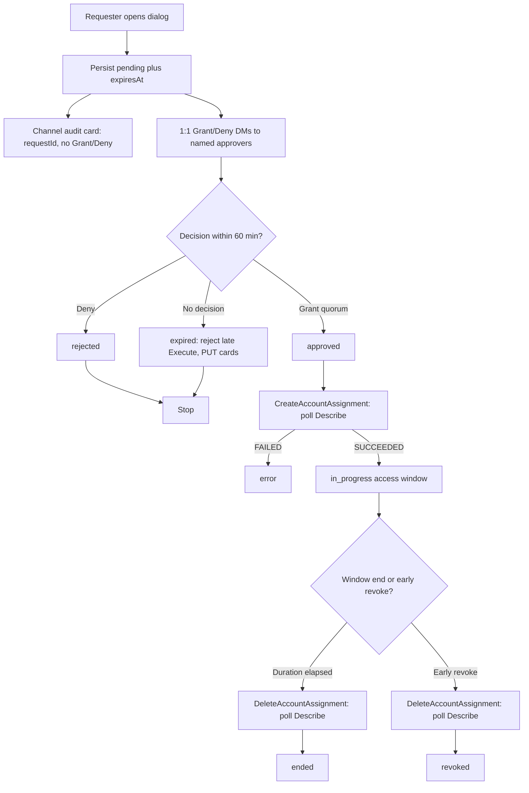
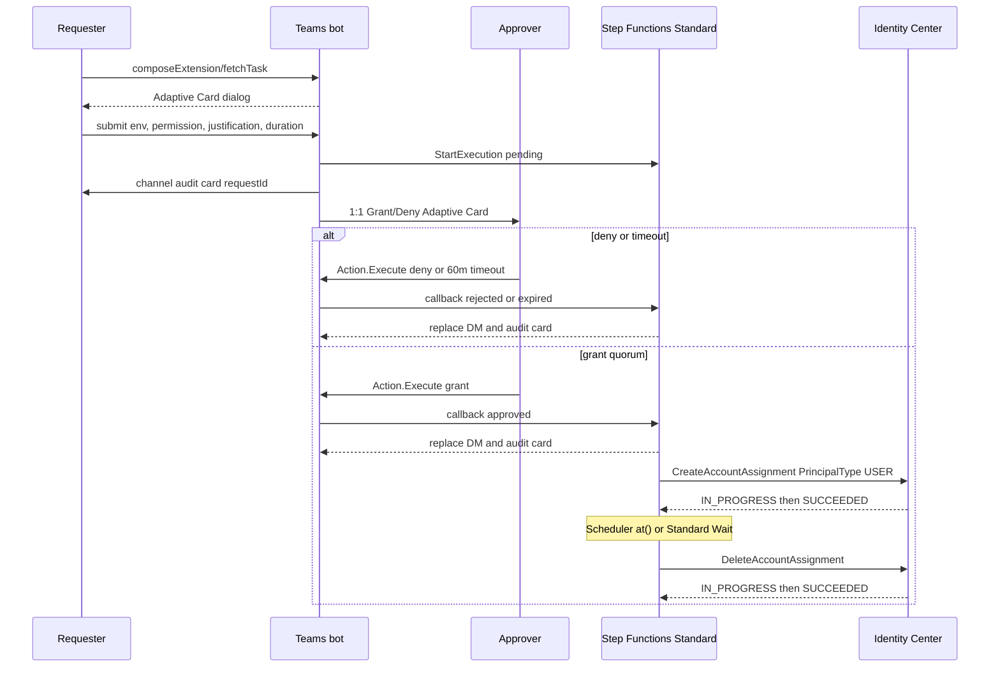

# Recommended setup

Locked 30 August 2026 against live Microsoft Learn and AWS documentation. Identity Center has no native JIT; this page is the implementable path.

## Decision

Ship a custom Microsoft Teams bot (Azure Bot Service, Adaptive Cards) that opens a request dialog in a standard `infra` channel, DMs named approvers for Grant/Deny, and drives a workflow in the IAM Identity Center **delegated-administrator** account: API Gateway → Lambda → Step Functions **Standard** → `CreateAccountAssignment` / `DeleteAccountAssignment`, with EventBridge Scheduler `at()` revoke (`ActionAfterCompletion=DELETE`, SQS DLQ). Copy the TEAM sample’s request **state model** and Identity Center assignment **APIs**. Do **not** deploy TEAM as the product (no Cognito / Amplify / AppSync web app). Do **not** use Amazon Q Developer in chat applications (service hard-denies `sso:*`, `identitystore:*`, `iam:*`, `sts:*`). Do **not** use Entra PIM for Groups on this path (SCIM lag, group-shaped standing assignments, approval is not in Teams). Do **not** use incoming webhooks / Office 365 connectors (retired May 2026). Teams cannot run a Slack-style instant `/request permission`; the closest form is an **action message extension** (`composeExtensions` type `action`, `fetchTask` Adaptive Card dialog). Manifest **1.29+** `triggers: ["slash"]` puts that command in the `/` picker and **opens a dialog without sending a message**. Also ship `@Bot request` via `commandLists` for mobile.

## Request lifecycle

TEAM states to persist (do not invent extra ones): `pending`, `approved`, `rejected`, `expired`, `cancelled`, `in_progress`, `ended`, `revoked`, `error`.

## Sequence

## Screenshots

Illustrative mockups of the intended UX, not product screenshots. Files sit beside this page.

| File | What it shows |
| --- | --- |
| [flow-request-dialog.png](flow-request-dialog.png) | Request dialog: environment `dev` / `uat` / `prod`, allow-listed permission level, required justification, access duration (default 4 hours, capped). |
| [flow-approver-dm.png](flow-approver-dm.png) | Named-approver 1:1 Adaptive Card with Grant / Deny (`Action.Execute` verbs `grant` / `deny`). |
| [flow-channel-audit.png](flow-channel-audit.png) | Standard `infra` channel audit card: `requestId`, requester, env, permission, duration, state. **No** Grant/Deny buttons. |

Microsoft’s command-bot flowchart is useful as the `@Bot request` mobile path (not the dialog): [Command bot in Teams](https://learn.microsoft.com/en-us/microsoftteams/platform/bots/how-to/conversations/command-bot-in-teams).

## Implementation steps

### 1. Prerequisites

1. Organization instance of IAM Identity Center in the **management** account (home Region). One per org.
2. Register **one** member account as Identity Center delegated administrator (`organizations:RegisterDelegatedAdministrator`, service principal `sso.amazonaws.com`). Run the JIT workflow **only** in that account. Delegated admin cannot manage permission sets or user access on the management account — keep it that way.
3. Entra (or other IdP) SAML + SCIM into Identity Center. MFA on the IdP. Identity Store is a replica; do not write users locally if SCIM is on.
4. Environment OUs: `dev`, `uat`, `prod`. Decide now whether those OUs are **flat** (accounts as direct children) or **nested**. `ListAccountsForParent` returns **direct children only**.
5. Organization CloudTrail trail covering the Identity Center home Region and the workflow account. Filter `eventSource = sso.amazonaws.com`, `eventName` in `CreateAccountAssignment` / `DeleteAccountAssignment`. Do **not** start a CloudTrail Lake event data store (closed to new customers 31 May 2026).
6. Elevated permission-set catalog provisioned into member accounts, **standing-unassigned**. Session duration `PT1H` (minimum and default). `PrincipalType` for JIT is `USER`.

### 2. Break-glass (before the bot)

7. Dedicated **emergency** account, independent of Identity Center **and** of Teams. Direct SAML from the IdP to IAM roles in that account; member accounts trust those roles via `sts:AssumeRole`. Keep the IdP app deactivated until needed. Use regional SAML ACS endpoints in a **different Region** than Identity Center. Alarm on every assume. JIT outage is a break-glass event, not a chat workaround.

### 3. Mapping tables (config, not code)

8. Persist these as versioned config the workflow reads. Fail closed on a miss.

| Table | Keys | Values | Rules |
| --- | --- | --- | --- |
| Environment → OU | `dev` / `uat` / `prod` | OU id | Expand with `ListAccountsForParent`. Recurse `ListChildren` (`ChildType=ORGANIZATIONAL_UNIT`) if nested. Paginate (`MaxResults` max 20). |
| Account filter | each account id | include / exclude | Drop management account. Keep only `State=ACTIVE` (`Status` retires **9 Sep 2026**). |
| Permission allow-list | env + level | permission-set ARN | Dialog ChoiceSet is this list. No free-text ARNs. |
| Approvers | env | Entra `aadObjectId`s | `dev`/`uat`: **one** approver. `prod`: **two distinct** approvers. Requester cannot be an approver on their own request. Channel membership is **not** authorization. |
| Duration | env | default + cap | Default **4 hours**. Cap in config. Identity Center has no assignment TTL. |
| Identity | Teams UPN / mail | Identity Store `UserId` | `GetUserId` `UniqueAttribute` path `userName`, then `emails.value`. Teams UPN is not guaranteed 1:1. Cache `UserId`. Fail closed if unresolved. |

### 4. Teams app

9. Entra app registration (single-tenant) + Azure Bot resource. Messaging endpoint `https://<api-gateway>/api/messages`. Enable the **Microsoft Teams** channel on the bot. Re-adding that channel regenerates keys and invalidates stored conversation ids.
10. Teams app package, `manifestVersion` **1.29+**:
    - `bots[].botId` = Entra app id.
    - `bots[].scopes`: `["team", "personal"]`.
    - `composeExtensions` command: `type: "action"`, `fetchTask: true`, `triggers: ["slash"]`, context `compose` / `commandBox`. This is the request form. Selecting it **opens a dialog and does not send a message**.
    - `bots[].commandLists` with a `request` command, scopes `team` and `personal`. Mobile requires a non-empty `commandLists`. This is `@Bot request`, not Slack `/request`.
11. Dialog fields: environment `dev|uat|prod`; permission level from the env allow-list; required justification; access duration with cap (default 4 hours). Adaptive Cards host cap is **1.6**. Grant/Deny uses `Action.Execute` verbs `grant` / `deny` (Universal Actions; card version 1.4+ with `fallback` `Action.Submit`, or 1.5).
12. Install the app in the **team** that owns standard channel `infra` (not a private channel). Install the app in **personal** scope for **every named approver**. Proactive send using `aadObjectId` without personal install returns **403** `ForbiddenOperationException`. Graph `TeamsAppInstallation.ReadWriteSelfForUser.All` only if auto-install is required (admin-consented application permission). Team install is **not** enough for 1:1 DMs.
13. After submit: persist the request; post the **audit** card to `infra` (`requestId`, no buttons); DM each named approver a Grant/Deny card; cache `{conversationId, activityId}` per card. Channel membership is visibility only.

### 5. AWS workflow (delegated-admin account)

14. Internet-facing path: API Gateway (+ WAF) → Lambda (Bot Framework adapter). Verify Bot Connector inbound JWT. Do not wrap `/api/messages` in a second JWT middleware if using the SDK adapter.
15. Step Functions **Standard** (not Express: 5-minute max). On create: write DynamoDB `pending`, `expiresAt = now+60m`, requester Identity Store `UserId`, target account ids, permission-set ARN, duration, approver ids. Approval wait: `waitForTaskToken` with `TimeoutSeconds=3600`, or a 60-minute Wait then expire.
16. On grant quorum: for each target account (management account already excluded), call `CreateAccountAssignment`:
    - `TargetType`: `AWS_ACCOUNT` only (no OU target).
    - `PrincipalType`: `USER`.
    - `PrincipalId`: Identity Store GUID from `GetUserId`.
    - HTTP 200 means **accepted**, not done. Poll `DescribeAccountAssignmentCreationStatus` until `SUCCEEDED` or `FAILED`. Do not report granted on `IN_PROGRESS`.
    - At most **15 outstanding creates**, not increasable. Batch and poll `ListAccountAssignmentCreationStatus` with `Status=IN_PROGRESS`. `ServiceQuotaExceededException` if exceeded.
17. On `SUCCEEDED`: state `in_progress`. Schedule revoke at assignment end:
    - **Preferred:** EventBridge Scheduler one-time `at(yyyy-mm-ddThh:mm:ss)`, `FlexibleTimeWindow.Mode=OFF`, `ActionAfterCompletion=DELETE`, target = revoke Lambda / `DeleteAccountAssignment`, **SQS DLQ** on the schedule. Without `DELETE`, completed one-time schedules still count against quota. Without DLQ, a failed revoke is silent.
    - **Also valid:** Step Functions Standard `Wait` until timestamp, then delete. Same state machine may cover approval + window.
18. Revoke: `DeleteAccountAssignment`, poll `DescribeAccountAssignmentDeletionStatus`. State `ended` (duration elapsed) or `revoked` (early). DynamoDB TTL is **not** the revoke timer (best-effort delete, typically within a few days). TTL is fine for request-record GC after revoke has already succeeded.
19. Timeout / late click: 60-minute **request** timeout is workflow-side. Teams has **no** Adaptive Card TTL. Targeted messages expire at **24 hours** — a different clock; do not use them as the timeout. Store `expiresAt`. On every `adaptiveCard/action`: if `now > expiresAt` or state ≠ `pending`, return a replacement card with **no** buttons and do not call Identity Center. At T+60m, `PUT` each stored activity so buttons disappear for approvers who never clicked.
20. After a decision, update/replace every Grant/Deny DM and the channel audit card. Sequential Universal Actions: invoke response replaces the clicker’s card; `PUT {serviceUrl}/v3/conversations/{conversationId}/activities/{activityId}` updates everyone else’s copy.

### 6. Go-live

21. Dry-run in `dev`: one approver, one account, 15-minute duration under the cap, confirm CloudTrail `CreateAccountAssignment` / `DeleteAccountAssignment`, confirm portal shows then drops the permission set, confirm late Grant is rejected.
22. `uat` same path. `prod` only after two-person Grant is proven and break-glass has been **tested** (not merely documented).
23. Standing elevated assignments: remove them. Standing read / scoped non-prod build access may remain. Only the workflow role may call `CreateAccountAssignment` for elevated permission sets.
24. If Teams or the workflow is down, use break-glass. Do not fall back to standing admin.

## Inventory

### Microsoft 365 / Azure — create

| Object | Role |
| --- | --- |
| Entra app registration | Bot App ID + credential. Single-tenant. |
| Azure Bot resource | Messaging endpoint; Microsoft Teams channel enabled. |
| Teams app package (manifest 1.29+) | `composeExtensions` action + `commandLists`; scopes `team` and `personal`. |
| Org-catalog upload | Sideload is not the production install path. |
| Team install | Required for standard channel `infra`. |
| Personal install per named approver | Required for Grant/Deny DMs. |
| Optional Graph permission `TeamsAppInstallation.ReadWriteSelfForUser.All` | Only if the bot must auto-install itself for approvers. |

Bot Connector JWT in and out is sufficient to post and `PUT` cards in conversations the bot is already in. Do not request tenant-wide `ChannelMessage.Read.All` / `TeamMember.Read.All` for this UX.

### AWS — by account

**Management account**

- IAM Identity Center organization instance (cannot move).
- `RegisterDelegatedAdministrator` for Identity Center.
- Organization CloudTrail trail (or CloudTrail delegated admin).
- SCPs on member accounts (lock CloudTrail, forbid leaving the org, forbid long-lived IAM users). SCPs do not apply to the management account.
- Pre-staged Deny SCP pattern on `identitystore:userId` for **compromise** revocation (keep ≥ 12 hours). Not used for routine JIT expiry.

**Identity Center delegated administrator (= workflow account)**

- API Gateway + WAF; Lambda (Teams adapter, grant, revoke, status poll).
- Step Functions **Standard**.
- DynamoDB (request state). Not the revoke timer.
- EventBridge Scheduler (`at()`, `ActionAfterCompletion=DELETE`).
- SQS DLQs (Lambda, Scheduler, Step Functions).
- Secrets Manager + KMS.
- CloudWatch Logs and alarms (failed revoke, stuck `IN_PROGRESS`, Scheduler DLQ depth).
- IAM roles: `sso:CreateAccountAssignment`, `sso:DeleteAccountAssignment`, `sso:DescribeAccountAssignmentCreationStatus`, `sso:DescribeAccountAssignmentDeletionStatus`, `sso:ListAccountAssignmentCreationStatus`, `sso:ListAccountAssignmentDeletionStatus`; `identitystore:GetUserId` / `DescribeUser`; `organizations:ListAccountsForParent`, `ListChildren`, `DescribeAccount`; `scheduler:CreateSchedule` / `DeleteSchedule`.

**Emergency account (not Identity Center, not Teams)**

- IAM SAML IdP + emergency IAM roles (`AssumeRoleWithSAML`).
- Member-account emergency roles that trust this account.

**Member accounts under env OUs**

- Identity Center–provisioned IAM roles for the elevated permission set (created by Identity Center, not by this workflow).
- Identity Center service-linked role (assignment fails if missing or SCP-blocked).
- Emergency cross-account roles.

### Do not use

| Thing | Why |
| --- | --- |
| Amazon Q Developer in chat applications | Hard-denies `sso:*`, `identitystore:*`, `iam:*`, `sts:*`. Not a PAM executor. |
| TEAM as the shipped product | Copy state model + assignment APIs only. TEAM has no Teams approval UX. |
| Entra PIM for Groups | SCIM-shaped groups, minutes-to-40-minute lag, deactivation is incremental cycle, approval is not a Teams card. |
| Incoming webhooks / Office 365 connectors | Retired May 2026. Wrong identity; cannot lifecycle Grant/Deny. |
| Step Functions Express | 5-minute max; cannot cover 60 min approval or 4 h access. |
| DynamoDB TTL as revoke | Days of lag. GC only. |
| CloudTrail Lake | Closed to new customers 31 May 2026. Org trail + CloudWatch / Athena. |
| Account instances of Identity Center | Cannot do org-wide permission sets / account assignment. |
| Private `infra` channel | Standard channel only. Private/shared need per-channel install and extra manifest flags. |
| Slack-style instant `/request` | Teams slash on a message extension opens a dialog; it does not execute a command. Agent slash still requires Send. |
| Channel membership as authorization | Named approver lists only. No self-approve. |
| `TargetType` other than `AWS_ACCOUNT` | Enum is `AWS_ACCOUNT` only. Expand OU → 12-digit account ids. |
| Organizations `Account.Status` | Retires 9 Sep 2026. Use `State`. |
| Assigning the management account from delegated admin | Cannot manage those permission sets. Exclude the id. |

## Clocks

Treat these as independent. Document them in the runbook and on the audit card.

| Clock | Owner | Duration | What it actually stops |
| --- | --- | --- | --- |
| **Approval timeout** | Workflow | **60 minutes** from `pending` | Late Grant/Deny. Teams will still invoke `Action.Execute` until the card is replaced. |
| **Assignment lifetime** | Workflow (Scheduler or Standard Wait) | Requested duration, default **4 hours**, capped | New assumes from the access portal / CLI. Identity Center has no native assignment TTL. |
| **Permission-set session** | Identity Center permission set | **1 hour** min and default (max 12 h). Set elevated sets to `PT1H`. | Already-issued console/CLI/SDK credentials. `DeleteAccountAssignment` does **not** kill in-flight STS. Realistic last access ≈ assignment end + remaining session (≤ 1 h here). |
| **Access portal session** | Identity Center / IdP | Independent (default 8 h; 15 min–90 days) | Portal sign-in only. Ending a portal session does **not** end IAM role sessions. |

!!! warning "Two clocks vs three"
    Operators often hear “revoke at 4 hours” and assume the session dies. There are **three** control clocks on the happy path (approval 60 m, assignment duration, permission-set session) plus an independent portal session. Targeted-message **24 h** client expiry is a fourth, Teams-only clock — ignore it for authorization.

Compromise path (not routine JIT): Deny SCP on `identitystore:userId`, then delete assignments. `AWSRevokeOlderSessions` cannot be attached to Identity Center–created roles.

## Caveats

1. **Personal install.** Approver DMs using `aadObjectId` require the app in that user’s personal scope. 403 otherwise. Graph auto-install is optional and tenant-admin-gated.
2. **15 in-flight creates.** `CreateAccountAssignment` outstanding async cap is 15 and **cannot be increased**. Expanding a large prod OU without batching will fail. Delete is also async; poll it; do not assume the same 15.
3. **Residual session.** After `DeleteAccountAssignment` succeeds, a session started late in the window lives until permission-set session expiry. CLI may cache credentials. Routine JIT accepts residual ≤ 1 h. Compromise uses the Deny SCP path.
4. **Nested OUs.** `ListAccountsForParent` does not recurse. If env OUs contain child OUs, recurse `ListChildren` or accounts will be silently omitted. Always paginate.
5. **Identity mapping.** Resolve `userName` then `emails.value`. Guest UPNs, aliases, and `onmicrosoft.com` vs corporate mail diverge. Unresolved principal = no assignment.
6. **Delegated admin vs management.** Workflow cannot JIT the management account. Do not provision elevated permission sets there.
7. **Create can fail after 200.** Poll to `SUCCEEDED`. IAM role quota or a blocked Identity Center SLR in the target yields `FAILED`.
8. **No card TTL.** Buttons stay live until the bot `PUT`s the activity or returns a replacement on Execute. Store `expiresAt` and reject late Execute even if the `PUT` lags.
9. **Scheduler precision** is 60 seconds. One-time `at()` still counts against schedule quota until `ActionAfterCompletion=DELETE` (or manual delete).
10. **Do not put secrets in cards.** Standard-channel audit text is visible to the team. System of record is DynamoDB + CloudTrail, not the thread.

## Primary docs

- [CreateAccountAssignment](https://docs.aws.amazon.com/singlesignon/latest/APIReference/API_CreateAccountAssignment.html)
- [DeleteAccountAssignment](https://docs.aws.amazon.com/singlesignon/latest/APIReference/API_DeleteAccountAssignment.html)
- [DescribeAccountAssignmentCreationStatus](https://docs.aws.amazon.com/singlesignon/latest/APIReference/API_DescribeAccountAssignmentCreationStatus.html)
- [Identity Center quotas (15 outstanding creates)](https://docs.aws.amazon.com/singlesignon/latest/userguide/limits.html)
- [Delegated administration](https://docs.aws.amazon.com/singlesignon/latest/userguide/delegated-admin.html)
- [ListAccountsForParent](https://docs.aws.amazon.com/organizations/latest/APIReference/API_ListAccountsForParent.html)
- [GetUserId](https://docs.aws.amazon.com/singlesignon/latest/IdentityStoreAPIReference/API_GetUserId.html)
- [Permission-set session duration](https://docs.aws.amazon.com/singlesignon/latest/userguide/howtosessionduration.html)
- [Emergency access (direct SAML)](https://docs.aws.amazon.com/singlesignon/latest/userguide/emergency-access.html)
- [Q Developer in chat applications — non-supported operations](https://docs.aws.amazon.com/chatbot/latest/adminguide/understanding-permissions.html)
- [CloudTrail Lake availability change](https://docs.aws.amazon.com/awscloudtrail/latest/userguide/cloudtrail-lake-service-availability-change.html)
- [EventBridge Scheduler ActionAfterCompletion](https://docs.aws.amazon.com/scheduler/latest/UserGuide/managing-schedule-delete.html)
- [Action message extension dialog](https://learn.microsoft.com/en-us/microsoftteams/platform/messaging-extensions/how-to/action-commands/create-task-module)
- [Command bot in Teams](https://learn.microsoft.com/en-us/microsoftteams/platform/bots/how-to/conversations/command-bot-in-teams)
- [Send proactive messages (personal install / 403)](https://learn.microsoft.com/en-us/microsoftteams/platform/bots/how-to/conversations/send-proactive-messages)
- [Universal Actions / Action.Execute](https://learn.microsoft.com/en-us/microsoftteams/platform/task-modules-and-cards/cards/universal-actions-for-adaptive-cards/work-with-universal-actions-for-adaptive-cards)
- [O365 connectors retirement](https://devblogs.microsoft.com/microsoft365dev/retirement-of-office-365-connectors-within-microsoft-teams/)
- [TEAM sample (reference implementation, do not ship)](https://github.com/aws-samples/iam-identity-center-team)
